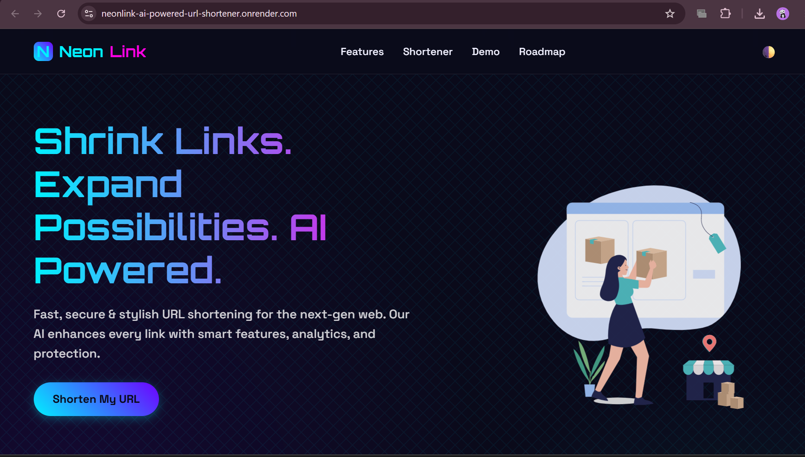

# 🚀 NeonLink - AI Powered URL Shortener

A modern URL Shortener built with **Flask** that allows users to create short URLs with custom aliases and QR code generation through a clean, responsive interface.

## 🌐 Live Demo

🔗 https://neonlink-ai-powered-url-shortner.onrender.com

## 📸 Preview




## ✨ Features

- 🔗 Shorten long URLs
- 🎯 Custom aliases
- 📱 QR code generation
- ⚡ Fast URL redirection
- 🎨 Responsive UI
- 🌙 Dark/Light Mode

## 🛠️ Tech Stack

- Python
- Flask
- HTML
- CSS
- JavaScript
- Render

## 🚀 Run Locally

```bash
git clone https://github.com/Rakshanda-05/URL-Shortener-System-.git
cd URL-Shortener-System-
pip install -r requirements.txt
python app.py
```

## 👨‍💻 Author

**Rakshanda**

⭐ If you found this project useful, consider giving it a star!
